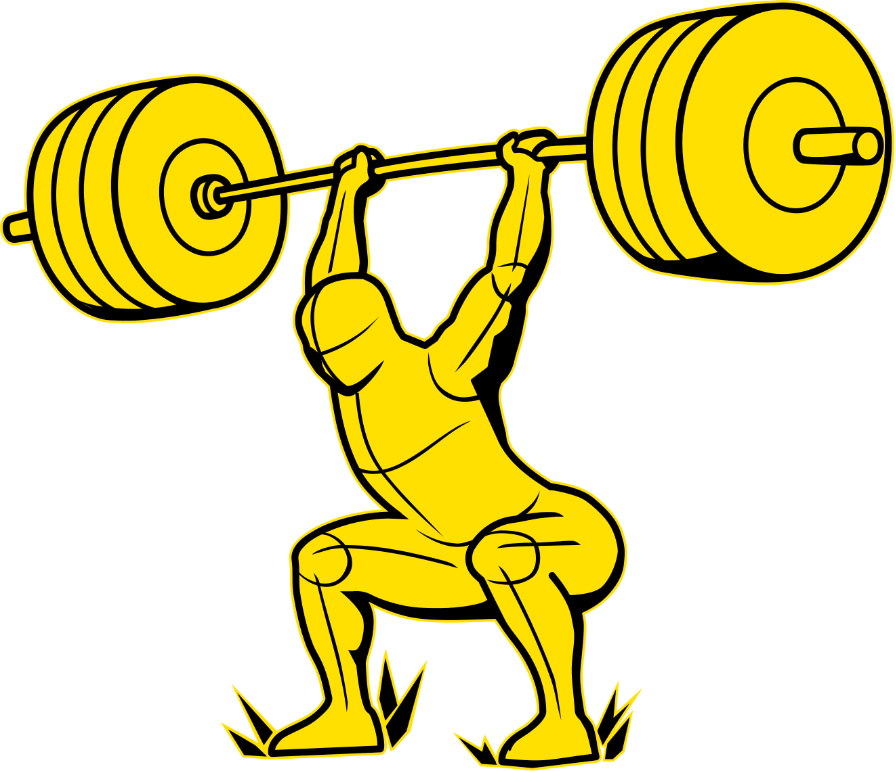
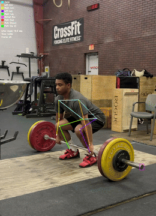

# BARPATH: AI-Powered Weightlifting Technique Analysis

**barpath** is an advanced biomechanical analysis tool that acts as a powerful training tool. Using computer vision and pose estimation, it analyzes Olympic lifts (clean, snatch, jerk) to provide detailed kinematic feedback, visualizations, and technique critiques.

[](https://www.python.org/downloads/)
[](LICENSE)
[]()

<div style="display: grid; grid-template-columns: repeat(3, 1fr); gap: 20px;">
    
    
</div>

## ✨ Features

- **🖥️ Dual Interface**: Command-line tool for batch processing and GUI for interactive analysis
- **⚡ Real-time Progress Tracking**: Generator-based architecture with live progress updates
- **🎯 Camera Shake Stabilization**: Uses Lucas-Kanade optical flow on background features to create perfectly stabilized bar path tracking
- **📐 3D Orientation Detection**: Automatically detects lifter orientation using MediaPipe's pseudo-depth (z-coordinate)
- **⚙️ Hardware-Accelerated Inference**: CPU-optimized inference with optional acceleration:
  - ONNX Runtime for cross-platform CPU optimization
  - OpenVINO support for Intel CPUs
  - Multi-threaded processing automatically configured for your CPU
- **📊 Comprehensive Kinematic Analysis**:
  - Smoothed vertical velocity, acceleration, and specific power graphs
  - Data automatically truncated at peak height (concentric phase focus)
  - Frame-by-frame joint angle measurements (knees, elbows, hips)
  - Temporal analysis of movement phases
- **🎥 Annotated Video Output**: 
  - Skeleton overlay with stabilized bar path visualization
  - Color-coded bar path phases (concentric/eccentric)
  - Persistent overlay at the end of the lift for easy review
- **🔍 Rule-Based Technique Critique**: Identifies common faults in Olympic lifts:
  - Early arm bend
  - Incomplete extension
  - Poor timing
  - Catching errors
  - and more!

## 🏗️ Project Structure

```
barpath/
├── README.md                         # Main documentation
├── LICENSE
├── .gitignore
├── .gitattributes                    # For git-lfs (YOLO models)
├── requirements.txt                  # Core dependencies
├── requirements-hardware.txt         # Optional hardware acceleration packages
├── setup.py                          # Package installation
│
├── barpath/                          # Core package
│   ├── barpath_core.py               # Pipeline orchestrator (generator-based)
│   ├── barpath_cli.py                # Command-line interface
│   ├── barpath_gui.py                # Toga GUI application
│   ├── hardware_detection.py         # Hardware detection utility
│   ├── briefcase_hardware_installer.py # Interactive hardware setup for Briefcase
│   │
│   ├── pipeline/                     # Analysis pipeline steps
│   │   ├── 1_collect_data.py         # Pose tracking and barbell detection
│   │   ├── 2_analyze_data.py         # Kinematic analysis
│   │   ├── 3_generate_graphs.py      # Visualization generation
│   │   ├── 4_render_video.py         # Annotated video rendering
│   │   ├── 5_critique_lift.py        # Technique analysis
│   │   └── utils.py                  # Shared utilities
│   │
│   ├── models/                       # Pre-trained YOLO models
│   │   ├── yolo11s50e.pt             # Small (fast)
│   │   ├── yolo11m50e.pt             # Medium (recommended)
│   │   └── yolo11l60e.pt             # Large (high accuracy)
│   │
│   └── assets/                       # Application assets
│       ├── barpath.png           # App icon/logo
│       ├── barpath.svg
│       └── barpath_logo.svg
│
├── outputs/                          # Generated kinematic plots and output video/data/analysis
├── example_videos/                   # Example videos for reference
└── tests/                            # Unit tests
```

## 🔧 Requirements

### System Dependencies

| Dependency | Purpose | Installation |
|------------|---------|--------------|
| **Python 3.8+** | Runtime environment | [python.org](https://www.python.org/downloads/) |
| **FFmpeg** | Video processing | See below |
| **Git LFS** | Large file support | See below |

Python packages required by barpath are listed in `requirements.txt`.

## 📦 Installation

### 1. Install System Dependencies

Ubuntu
```bash
sudo apt update
sudo apt install ffmpeg python3-pip git git-lfs libcairo2-dev pkg-config libgirepository-2.0-dev gir1.2-gtk-3.0 libgirepository-2.0-0
```
macOS
```
brew install ffmpeg git git-lfs python
```
On Windows, install:  
[git](https://github.com/git-guides/install-git%20#install-git-on-windows) 
[ffmpeg](https://ffmpeg.org/download.html) 
[python](https://www.python.org/downloads/windows)

### 2. Clone the Repository

```bash
# Clone with Git LFS (downloads models automatically)
git clone https://github.com/scribewire/barpath
cd barpath
```

### 3. Install Python Dependencies

```bash
pip install -r requirements.txt
```

This installs the core pipeline libraries and the Toga GUI dependency. 

### 3.5. Optional: Install Hardware Acceleration (Recommended)

barpath can use hardware-accelerated inference for faster model processing. The specific packages depend on your OS and hardware.

#### Automatic Setup (Interactive)

Run the interactive hardware detector:

```bash
python barpath/briefcase_hardware_installer.py
```

This will:
1. Detect your OS and CPU brand
2. Show available acceleration options for your hardware
3. Prompt you to select which packages to install
4. Provide the exact pip command to run

#### Manual Setup

See `requirements-hardware.txt` for all available options, or install based on your hardware:

**Windows**
- `pip install onnxruntime`
- Intel CPU: `pip install onnxruntime openvino` (optional, adds Intel optimization)

**macOS**
- `pip install onnxruntime`

**Linux**
- `pip install onnxruntime`
- Intel CPU: `pip install onnxruntime openvino` (optional, adds Intel optimization)

#### Using setup.py extras

If you installed barpath via `setup.py`, you can install hardware acceleration with:

```bash
pip install .[hardware]      # Install all recommended for your hardware
pip install .[onnx]          # Install ONNX acceleration only
pip install .[openvino]      # Install OpenVINO only
```

**Note:** Hardware acceleration is optional. barpath will work fine with CPU-only inference, just slower.

### 4. Verify Installation

```bash
# Check barpath CLI
python barpath/barpath_cli.py --help

# Verify models downloaded (should be ~20-50 MB each, not tiny)
ls -lh barpath/models/*.pt

# (Optional) Verify hardware acceleration is available
python -c "from barpath.hardware_detection import get_hardware_profile, get_optional_packages; p=get_hardware_profile(); print('Hardware Profile:', p); o,v=get_optional_packages(p); print('Recommended packages:', o+v)"
```

### 5. Launch the GUI

Once dependencies are installed, you can run the desktop GUI:

```bash
python barpath/barpath_gui.py
```

## 🚀 Quick Start

### Graphical User Interface (Recommended)

```bash
python barpath/barpath_gui.py
```

The GUI provides an intuitive interface for:
- 📂 Interactive file/directory selection
- 🎯 Model auto-detection from directory
- ⚡ Runtime selection dropdown (shows available CPU options)
- 📊 Real-time progress tracking and live log output
- 👁️ View analysis reports directly in the application

### Command Line Interface

For scripting and batch processing, use the CLI with these options:

### Command Line Options

```
Required Arguments:
  --input_video PATH         Path to source video file
                            (e.g., 'videos/clean.mp4')
  
  --model PATH              Path to trained YOLO model file
                            (e.g., 'models/yolo11s.pt', 'models/yolo11s.onnx')

Optional Arguments:
  --output_video PATH       Path to save annotated video
                            (Default: outputs/output.mp4)
  
  --lift_type {clean,snatch,none}
                            Type of lift to analyze and critique
                            'clean'  - Power clean technique critique
                            'snatch' - Snatch technique critique
                            'none'   - Skip technique critique (default)
  
  --no-video                Skip video rendering (Step 4)
                            Graphs and analysis still generated (faster)
  
  --output_dir PATH         Directory to save generated outputs
                            (Default: outputs)
```

### GUI Features

The graphical interface provides:
- 📂 Interactive file/directory selection
- 🎯 Model auto-detection from directory
- ⚡ Runtime selection dropdown:
  - Shows installed hardware acceleration options
  - Dynamically updates based on selected model
  - Defaults to CPU (fastest compatibility)
- 📊 Real-time progress tracking
- 📝 Live log output during analysis
- 👁️ View analysis reports directly in the application

### Quick Start Examples

**CPU-only (fast startup, works everywhere):**
```bash
python barpath/barpath_cli.py \
  --input_video "lift.mp4" \
  --model "barpath/models/yolo11s.pt" \
  --lift_type clean
```

**With OpenVINO (Intel CPUs):**
```bash
python barpath/barpath_cli.py \
  --input_video "lift.mp4" \
  --model "barpath/models/yolo11s_openvino_model" \
  --lift_type clean
```

**Skip video rendering (analyze only):**
```bash
python barpath/barpath_cli.py \
  --input_video "lift.mp4" \
  --model "barpath/models/yolo11s.pt" \
  --lift_type snatch \
  --no-video
```

**GUI (recommended for interactive analysis):**
```bash
python barpath/barpath_gui.py
```

### Running Individual Pipeline Steps

For debugging or custom workflows, run steps independently:

```bash
# Step 1: Collect raw tracking data
python barpath/pipeline/1_collect_data.py \
  --input video.mp4 \
  --model barpath/models/yolo11m50e.pt \
  --output raw_data.pkl

# Step 2: Analyze kinematics and angles
python barpath/pipeline/2_analyze_data.py \
  --input raw_data.pkl \
  --output final_analysis.csv

# Step 3: Generate kinematic graphs
python barpath/pipeline/3_generate_graphs.py \
  --input final_analysis.csv \
  --output_dir graphs

# Step 4: Render annotated video
python barpath/pipeline/4_render_video.py \
  --input_csv final_analysis.csv \
  --input_video video.mp4 \
  --output_video final.mp4

# Step 5: Generate technique critique
python barpath/pipeline/5_critique_lift.py \
  --input final_analysis.csv \
  --lift_type clean
```

## 📂 Output Files

After running the pipeline, you'll find:

### Generated Files

| File | Description |
|------|-------------|
| `raw_data.pkl` | Serialized tracking data (pose landmarks, barbell detections, optical flow) |
| `final_analysis.csv` | Processed data with kinematics, angles, and stabilized coordinates |
| `outputs/` | Directory containing plots, analysis document, output video |
| `output.mp4` | Annotated video with skeleton and bar path overlay (if `--no-video` not used) |

### Graph Files (in `graphs/` directory)

- `barbell_xy_stable_path.png` - Smoothed barbell 2D path
- `velocity_smooth.png` - Smoothed vertical velocity
- `acceleration_smooth.png` - Smoothed vertical acceleration
- `specific_power_smooth.png` - Smoothed specific power (Power-to-Mass ratio proxy)

### Console Output

The technique critique is printed to the console with:
- Phases timing
- Critique content

## 🎥 Recording Best Practices

For optimal tracking results:

### 1. Camera Position
- **Ideal**: 45° side view
- **Height**: Camera at hip level

### 2. Camera Stability
- ✅ Use a tripod or stable surface
- ✅ Some camera shake is OK (pipeline compensates)
- ❌ Avoid handheld recording
- ❌ Don't pan or zoom during lift

### 3. Visibility Requirements
- ✅ Entire body visible throughout lift (head to feet)
- ✅ Nearest **barbell endcap** clearly visible
- ✅ No occlusions (people, equipment in foreground)
- ✅ Consistent lighting

### 4. Video Quality
- For a good balance between quality and processing speed:
    - **Resolution**: 1080p recommended
    - **Frame Rate**: 30 fps recommended
- **Format**: MP4, MOV, mkv, webm, or AVI

## 🐛 Troubleshooting

### Runtime Errors

**"Error loading YOLO model"**
- ✅ Verify model path is correct
- ✅ Check model file is a valid `.pt` file (not a pointer)
- ✅ Ensure model was trained with Ultralytics YOLO
- ✅ Try a different model from `models/` directory

**"Could not detect barbell"**
- ✅ Ensure barbell endcap is visible in video
- ✅ Check class definition matches model, default models use class `endcap`

**"KeyError: 'barbell_center'"**
- This indicates barbell was not detected in any frame
- Solution: Check video quality and barbell visibility
- Fallback: Analysis still runs, but bar path will be missing

**"Missing required data columns"**
- Usually indicates MediaPipe pose detection failed
- ✅ Ensure lifter's full body is visible
- ✅ Check lighting conditions
- ✅ Verify no occlusions blocking the person

### Performance Issues

**Slow inference or video processing**
- ✅ Install hardware acceleration packages (see Installation section 3.5)
- ✅ Use a faster YOLO model: `yolo11s50e.pt` instead of `yolo11l60e.pt`
- ✅ Reduce video resolution before processing
- ✅ Use `--no-video` flag to skip video rendering

**To check if hardware acceleration is active:**
```bash
python -c "from barpath.pipeline import _get_yolo_device; print(_get_yolo_device())"
```
- Should show: `cpu` (CPU inference is used)

### Verifying Hardware Acceleration Installation

After installing acceleration packages, verify they're working:

```bash
# Check ONNX Runtime providers
python -c "import onnxruntime; print(onnxruntime.get_available_providers())"

# Check OpenVINO installation (if installed)
python -c "import openvino; print('OpenVINO version:', openvino.__version__)"
```

Expected output for your hardware:
- **All platforms**: `['CPUExecutionProvider']`
- **Intel CPUs with OpenVINO**: OpenVINO available as separate runtime option

### FFmpeg Errors

**"Could not initialize video writer"**
- Check output directory exists and is writable
- Verify sufficient disk space
- Try a different output format (change file extension)

## 📦 Building Installers with Briefcase

barpath can be packaged as standalone installers for Windows, macOS, and Linux using [Briefcase](https://briefcase.readthedocs.io/).

### Prerequisites

1. **Install Briefcase:**
   ```bash
   pip install briefcase
   ```

2. **Platform-specific requirements:**
   - **Windows**: No additional setup needed
   - **macOS**: Xcode Command Line Tools (`xcode-select --install`)
   - **Linux**: Build tools and dependencies

### Building Installers

#### 1. Create the app (first time only)

```bash
# Create the Briefcase app structure for your target platform
briefcase create windows      # or macos, linux
```

This sets up the app directory structure needed for building.

#### 2. Build the application

```bash
# Build the executable/app bundle
briefcase build windows       # or macos, linux
```

The built app will be in `build/barpath/windows/app/` (or your platform).

#### 3. Package as an installer

```bash
# Create the installer package
briefcase package windows     # or macos, linux
```

This creates platform-specific installers:
- **Windows**: `.msi` file in `build/barpath/windows/msi/`
- **macOS**: `.dmg` file in `build/barpath/macos/dmg/`
- **Linux**: `.deb` file in `build/barpath/linux/deb/`

#### 4. Run the installer

```bash
# After packaging, users can install with:
# Windows: Double-click the .msi file
# macOS: Double-click the .dmg file and drag to Applications
# Linux: sudo dpkg -i build/barpath/linux/deb/barpath*.deb
```

### Full Build Workflow Example

```bash
# All-in-one build (for Windows)
briefcase create windows
briefcase build windows
briefcase package windows

# Find your installer in:
# build/barpath/windows/msi/barpath-1.0.0.msi
```

### Hardware Acceleration in Briefcase Installers

The Briefcase installer will automatically include the hardware acceleration detection:

1. **During installation**: Users can run the hardware setup wizard:
   ```bash
   python -m barpath.briefcase_hardware_installer
   ```

2. **Or use setup.py extras**: After installation, users can add acceleration:
   ```bash
   pip install barpath[hardware]
   ```

3. **Or manual selection**: Users choose their hardware packages from `requirements-hardware.txt`

### Build Output Locations

```
build/
├── barpath/
│   ├── windows/
│   │   ├── app/              # Built application files
│   │   └── msi/              # Windows installer (.msi)
│   ├── macos/
│   │   ├── app/              # Built application bundle
│   │   └── dmg/              # macOS installer (.dmg)
│   └── linux/
│       ├── app/              # Built application files
│       └── deb/              # Linux installer (.deb)
```

**Note**: The `build/` directory is already in `.gitignore`, so installers won't be committed to the repository.

### Configuration

Briefcase uses `pyproject.toml` or `setup.cfg` for configuration. For barpath, key settings are:

- Application name: barpath
- Version: Matches `setup.py`
- Main module: barpath.barpath_gui
- Icon: `barpath/assets/barpath.png`

To customize the installer, edit your `pyproject.toml`:

```toml
[tool.briefcase.app.barpath]
formal_name = "Barpath - Weightlifting Analysis"
bundle = "com.scribewire"
version = "1.0.0"
description = "AI-powered biomechanical analysis for Olympic lifts"
sources = ['barpath']
icon = "barpath/assets/barpath"

# Windows-specific
[tool.briefcase.app.barpath.windows]
installer_icon = "barpath/assets/barpath.ico"

# macOS-specific  
[tool.briefcase.app.barpath.macos]
universal_build = false
requires = [
    "PyYAML>=5.3.1",
]
```

### Troubleshooting Briefcase Builds

**"Could not find Python installation"**
- Ensure Python is in PATH
- Use `python -m briefcase` instead of `briefcase` command

**"Missing dependencies"**
- All dependencies in `requirements.txt` are automatically included
- Hardware packages must be added manually or via the hardware installer script

**"Icon not found"**
- Ensure `barpath/assets/barpath.png` exists
- For Windows .msi, also create or convert to `.ico` format

**Large installer size**
- Normal for Python GUI apps (~500 MB-1 GB)
- Includes Python runtime, all dependencies, and PyTorch/MediaPipe
- Consider using compression in Briefcase settings

### Cross-Platform Building

To build for multiple platforms, you'll need to run Briefcase on each OS:

```bash
# On Windows machine
briefcase create windows && briefcase build windows && briefcase package windows

# On macOS machine
briefcase create macos && briefcase build macos && briefcase package macos

# On Linux machine
briefcase create linux && briefcase build linux && briefcase package linux
```

Or use CI/CD (GitHub Actions, etc.) to automate cross-platform builds.

### Updating Installers

When you update barpath code:

```bash
# Just rebuild and repackage (no need to create again)
briefcase build windows
briefcase package windows
```

Briefcase will detect changes and rebuild only what's necessary.

## 📊 Project Status

**Current Status: Alpha (v0.9)**

### ✅ Recently Completed
- **Graphical user interface (GUI)** - Toga-based desktop application
- **Refactored architecture** - Generator-based pipeline with real-time progress
- **Dual interface support** - Both CLI and GUI fully functional

### 🚧 In Development
- Additional lift types (snatch, jerk)
- Advanced critique rules
- Option to select video segment for analysis

### 🔮 Planned Features
- Cloud processing option
- Athlete progress tracking
- Comparative analysis (vs. elite lifters)
- Export to coaching platforms

### Known Limitations
- Only "clean" lift fully supported for critique
- Requires stable camera position
- Barbell endcap must be visible for whole lift
- No real-time processing

## 🤝 Contributing

This project is in active development. Contributions welcome!

### How to Contribute
1. Fork the repository
2. Create a feature branch (`git checkout -b feature/amazing-feature`)
3. Commit your changes (`git commit -m 'Add amazing feature'`)
4. Push to the branch (`git push origin feature/amazing-feature`)
5. Open a Pull Request

## 🙏 Acknowledgments

Built with amazing open-source tools:

- **[Ultralytics YOLO](https://github.com/ultralytics/ultralytics)** - State-of-the-art object detection
- **[MediaPipe](https://google.github.io/mediapipe/)** - Real-time pose estimation by Google
- **[OpenCV](https://opencv.org/)** - Computer vision and video processing
- **[pandas](https://pandas.pydata.org/)** - Data analysis and manipulation
- **[matplotlib](https://matplotlib.org/)** - Visualization and graphing
---

**Made with ❤️ for weightlifters, by weightlifters**
